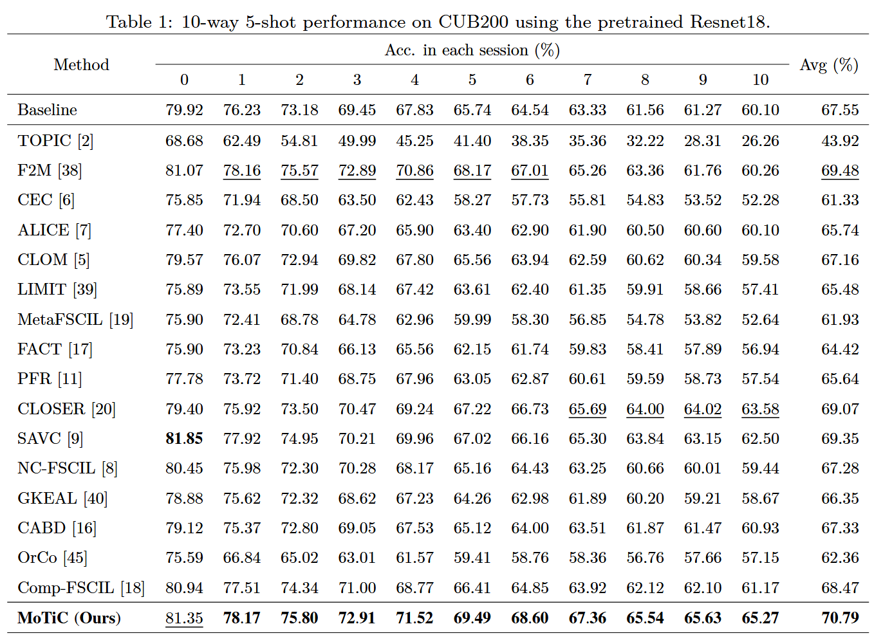
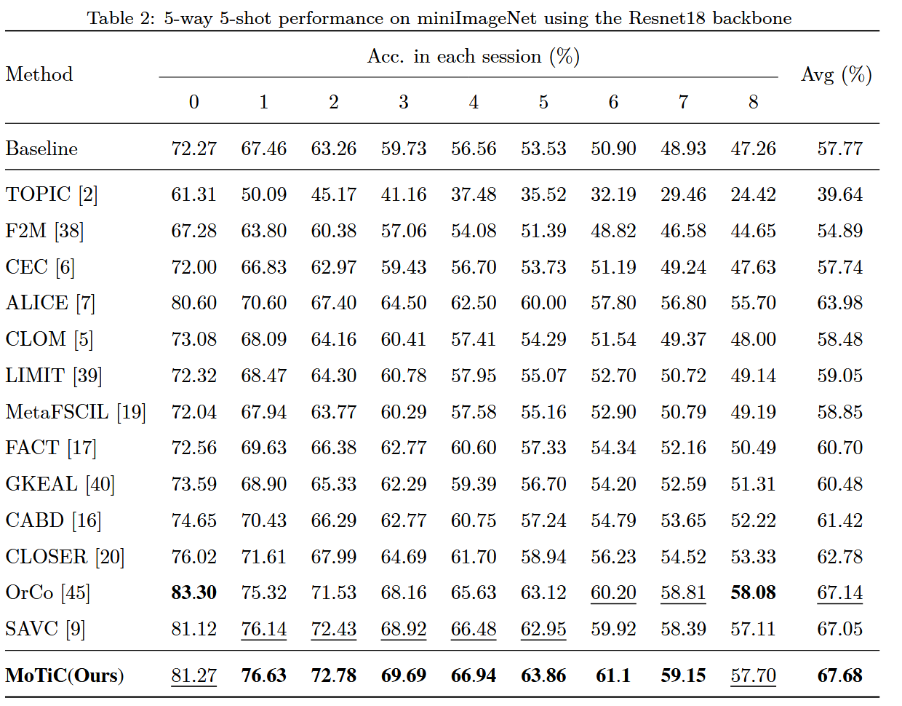
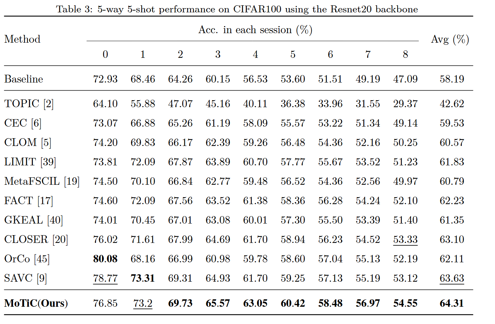

# MoTiC
Code for MoTiC: Momentum Tightness and Contrast for Few-Shot Class-Incremental Learning

link:[[2509.19664\] MoTiC: Momentum Tightness and Contrast for Few-Shot Class-Incremental Learning](https://arxiv.org/abs/2509.19664)

# Abstract

Few-Shot Class-Incremental Learning (FSCIL) must contend with the dual challenge of  learning new classes from scarce samples while preserving old class knowledge. Existing methods use the frozen feature extractor and class-averaged prototypes to mitigate  against catastrophic forgetting and overfitting. However, new-class prototypes suffer  significant estimation bias due to extreme data scarcity, whereas base-class prototypes  benefit from sufficient data. In this work, we theoretically demonstrate that aligning  the new-class priors with old-class statistics via Bayesian analysis reduces variance and  improves prototype accuracy. Furthermore, we propose large-scale contrastive learning  to enforce cross-category feature tightness. To further enrich feature diversity and inject prior information for new-class prototypes, we integrate momentum self-supervision  and virtual categories into the Momentum Tightness and Contrast framework (MoTiC),  constructing a feature space with rich representations and enhanced interclass cohesion.  Experiments on three FSCIL benchmarks produce state-of-the-art performances, particularly on the fine-grained task CUB-200, validating our method’s ability to reduce  estimation bias and improve incremental learning robustness.

## Results









# Datasets and environment

Please follow the instruction in [CLOSER ](https://github.com/JungHunOh/CLOSER_ECCV2024)

# Training Scripts

cub200

```bash
python -m pdb train.py  -dataset cub200 -lr_base 0.005 -epochs_base 70 -gpu 0 -batch_size_base 64 -seed 1 --ssc_lamb 0.01 --inter_lamb 2.5 --ssc_temp 0.07 --temp 32 -project motic -fantasy rotation2
```

miniImageNet

```markdown
python -m pdb train.py  -dataset mini_imagenet -lr_base 0.1 -epochs_base 200 -gpu 0 -batch_size_base 128 -seed 1 --ssc_lamb 0.1 --inter_lamb 1.5 --ssc_temp 0.03 --temp 32 -project motic -fantasy rotation
```

cifar100

```bash
python -m pdb train.py  -dataset cifar100 -lr_base 0.1 -epochs_base 200 -gpu 0 -batch_size_base 128 -seed 1 --ssc_lamb 0.1 --inter_lamb 2.5 --ssc_temp 0.01 --temp 32 -project motic -fantasy rotation2
```

## Acknowledgment

Our project references the codes in the following repos:

[SAVC](https://github.com/zysong0113/SAVC)

[CLOSER](https://github.com/JungHunOh/CLOSER_ECCV2024)
